1基本不等式

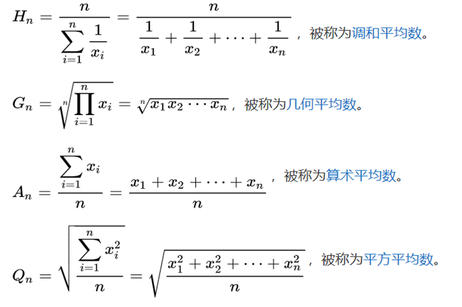

调和＜几何＜算术＜平方  要记就记多维均值不等式

2排序不等式

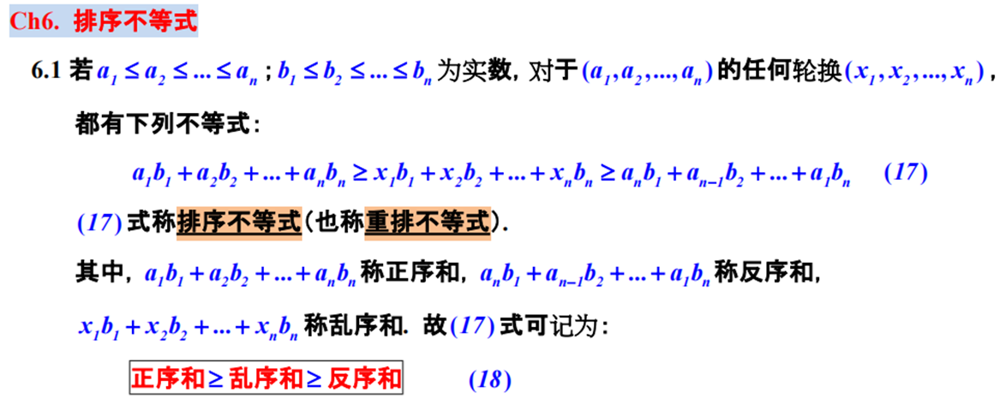

3柯西不等式

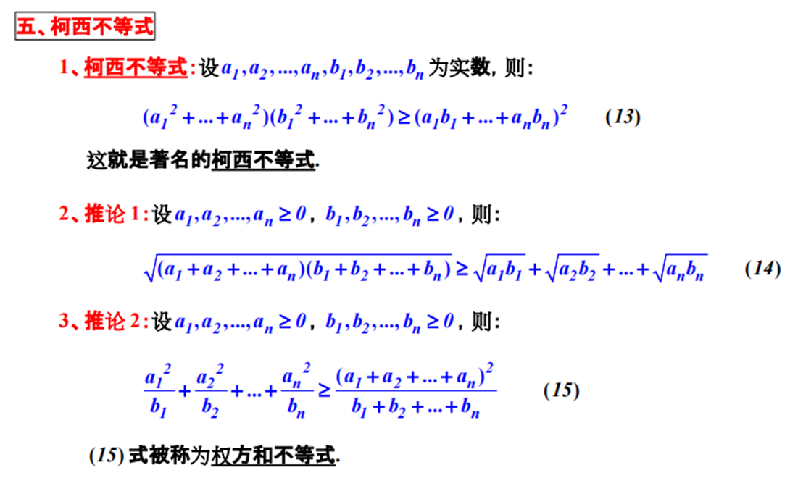

4琴生不等式

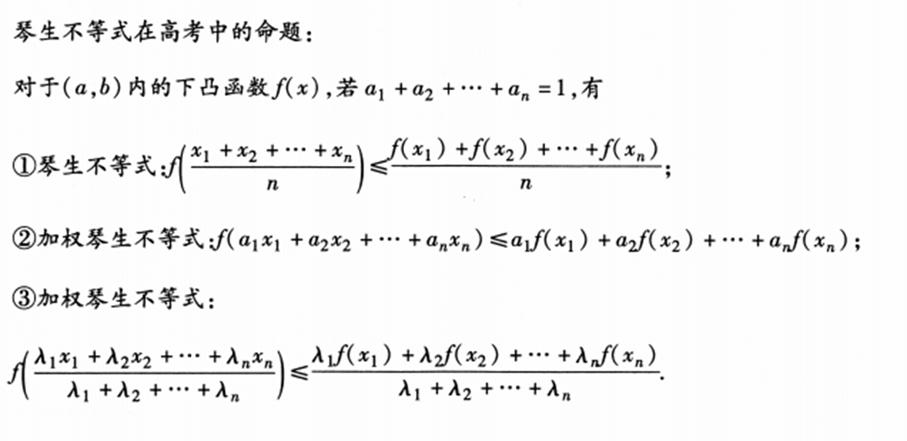

5贝努利不等式

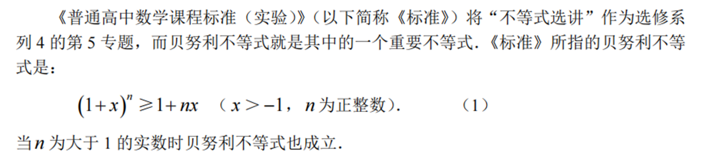

6绝对值不等式

公式：||a|-|b|| ≤|a±b|≤|a|+|b|

此公式在选修题的应用较多

7不等式求值问题

①地位等价法

一般当所有变量地位等价时，令所有变量地位相等就可以得到最值（不万能）

②万能K法

在题目给定关于x, y的一个二次式，要求另一个代数式的值，直接令此式子等于k，然后用y表示x，代入原式，得到一个关于x的一元二次方程，利用判别式大于等于零，得到一个不等式，解出k的范围。此方法，称之为万能k法。（不万能）

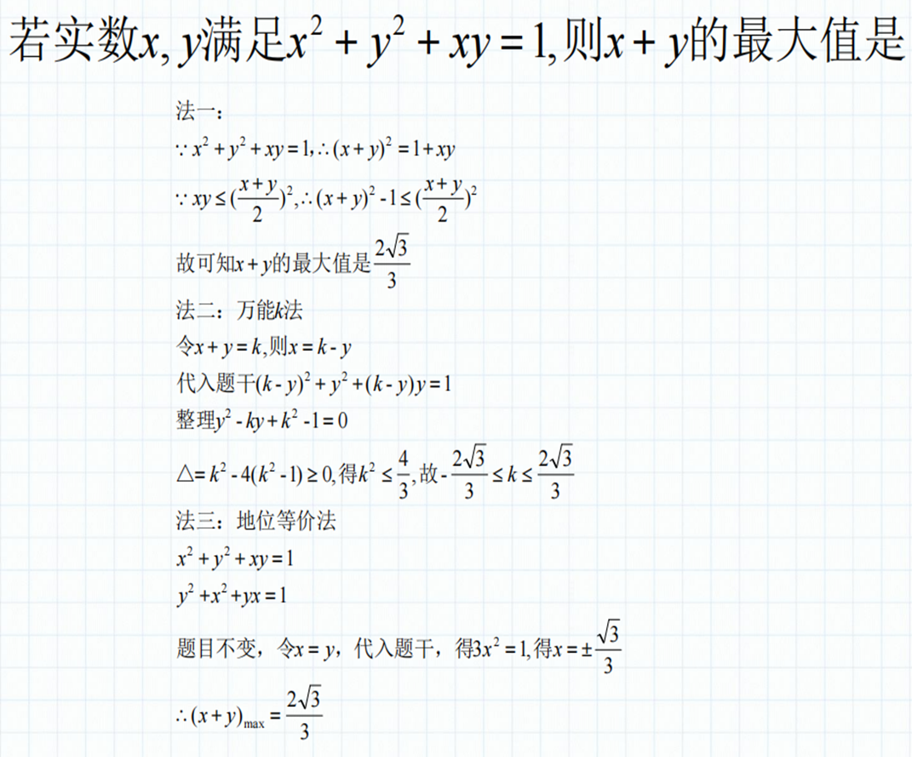

③常见形式

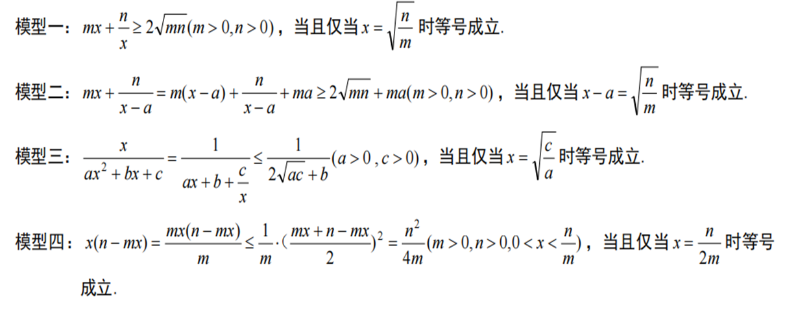

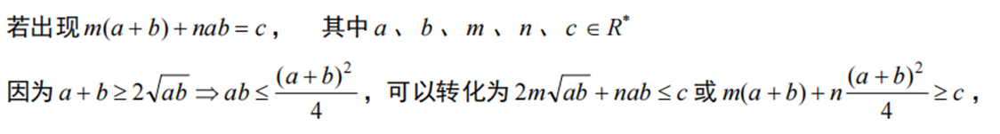

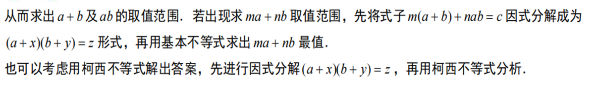

④拉格朗日乘数法

实际可称为“暴算求最值”此法以计算量代替思维量

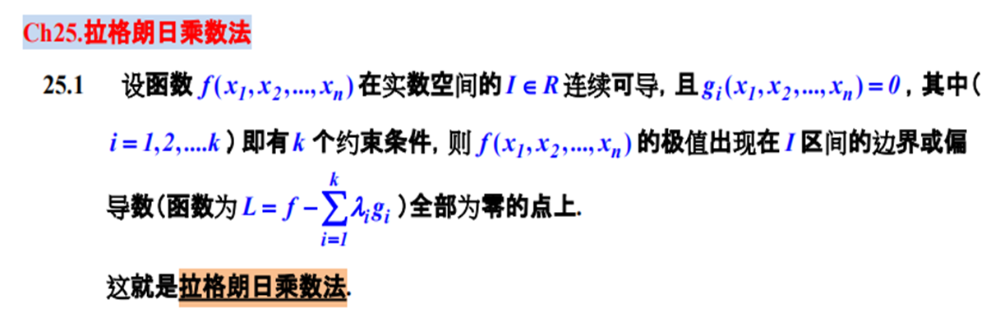

偏导数（见同济大学《高等数学》下册第九章“多元函数微分法及应用”）简单来讲是多变量函数中以某一变量作为自变量求导后得到的导数（此法可具体参考网络视频教程，此处因篇幅有限不详细介绍）

8比大小问题专项

①比大小问题常用方法

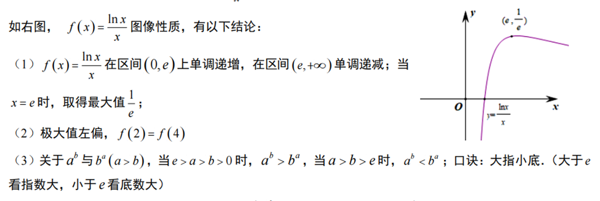

②糖水原理（与换底公式结合）

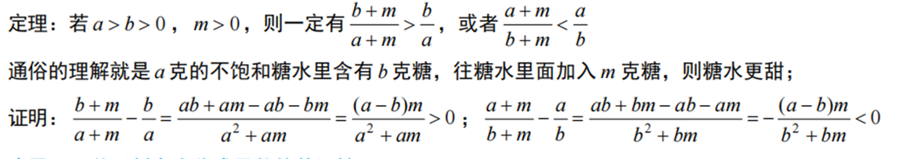

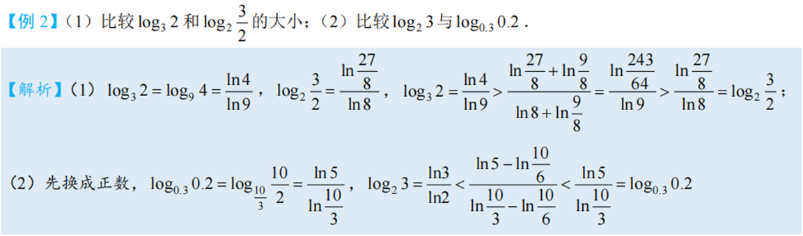