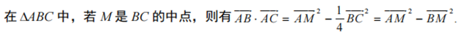
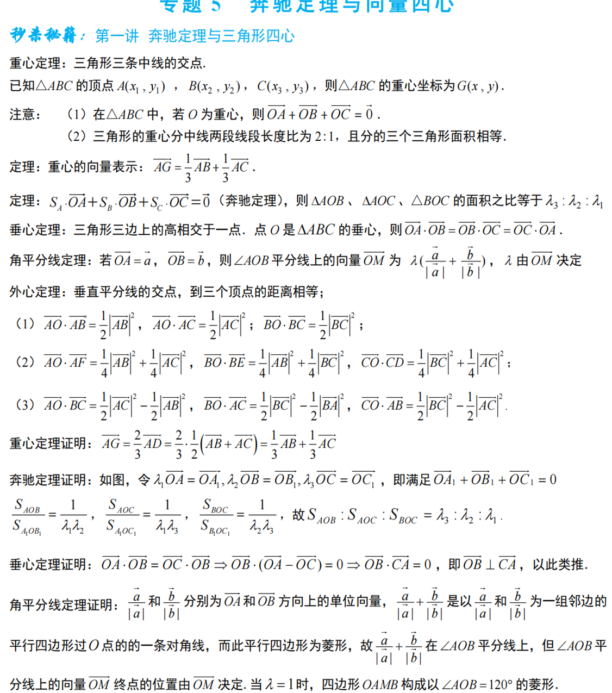
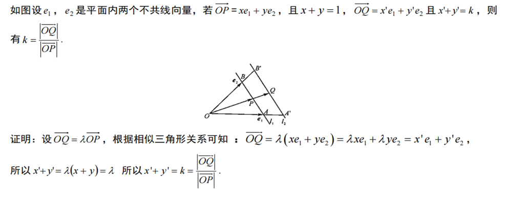
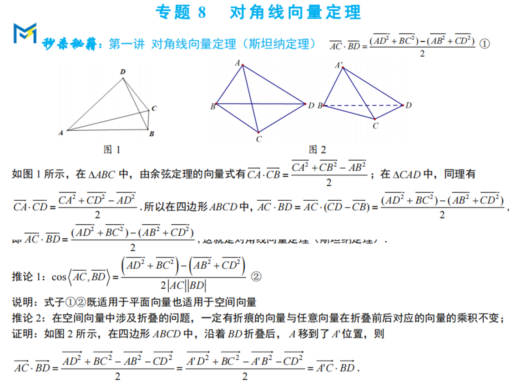
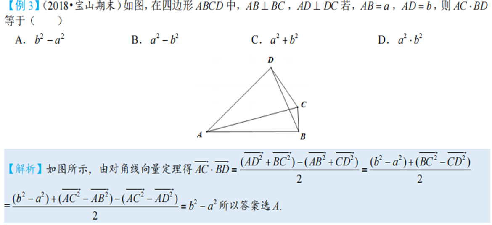

向量是一种高级语言，用向量语言可以书写新的高中数学体系。人生如向量，它与我们的人生有着很多相似之处。选择决定了人生的方向，努力决定了人生的长度。

笔者认为：小题中向量题目，无图计算，有图建系。建系法为主，基底法为辅，方可畅行无阻

1向量的基底与向量共线定理

2向量的极化恒等式

极化恒等式是平面向量中应用最广泛的结论，其将向量的数量积全部转换到模长的运算，作用极大

3平面向量与三角形的四心问题（奔驰定理）

4向量的等和线

5向量对角线定理（斯坦纳定理）

此定理常用于空间向量中，其特点是省去了对空间关系的思考，仅用模长就可求出数量积。多应用于已知大多线段模长的定图形和折叠问题中

此处搭配例题以助理解

