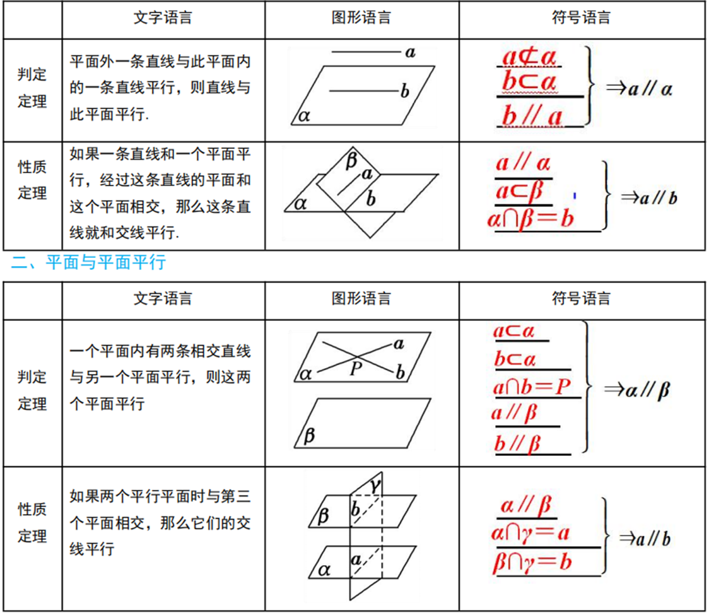
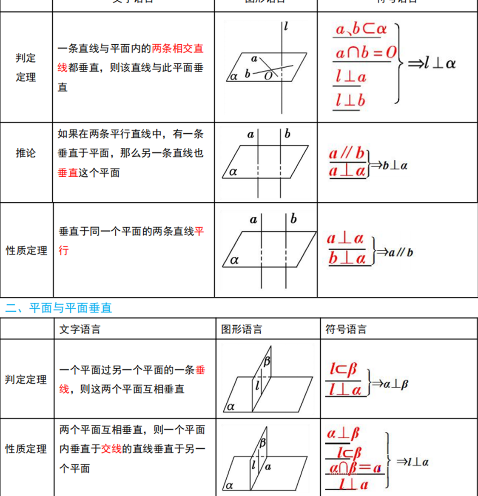
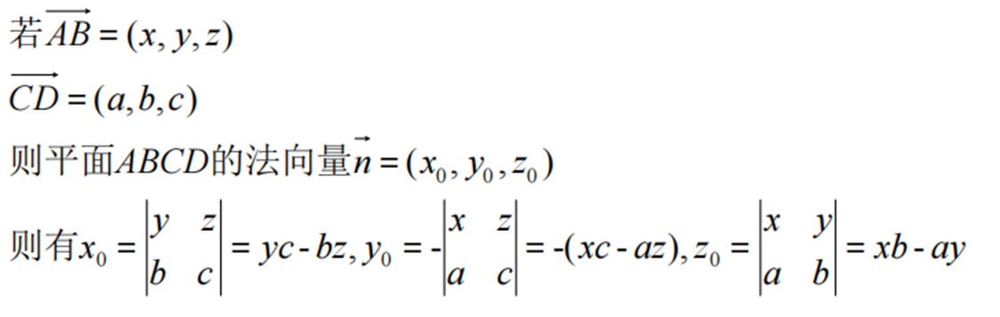
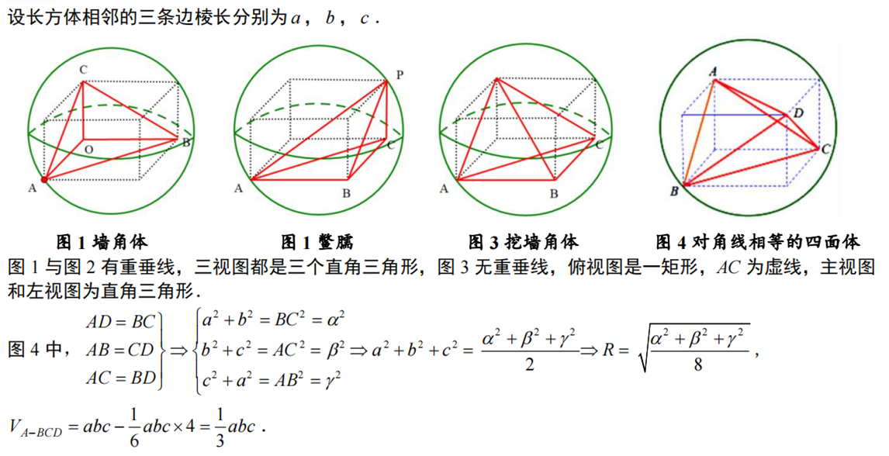
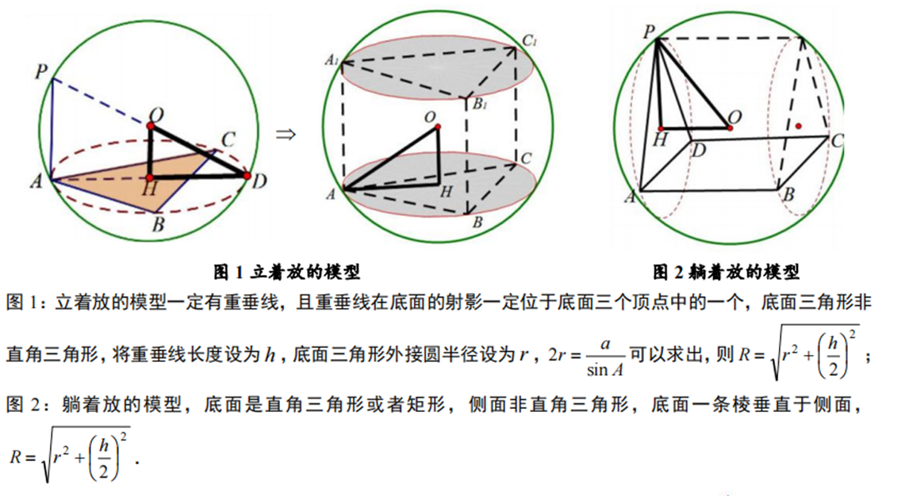
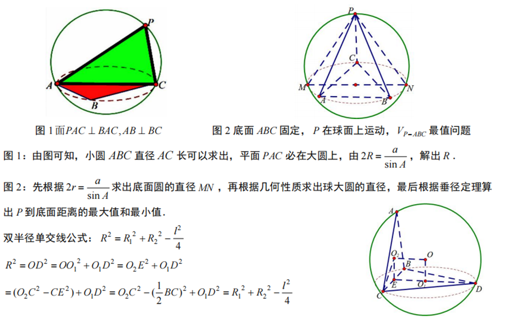
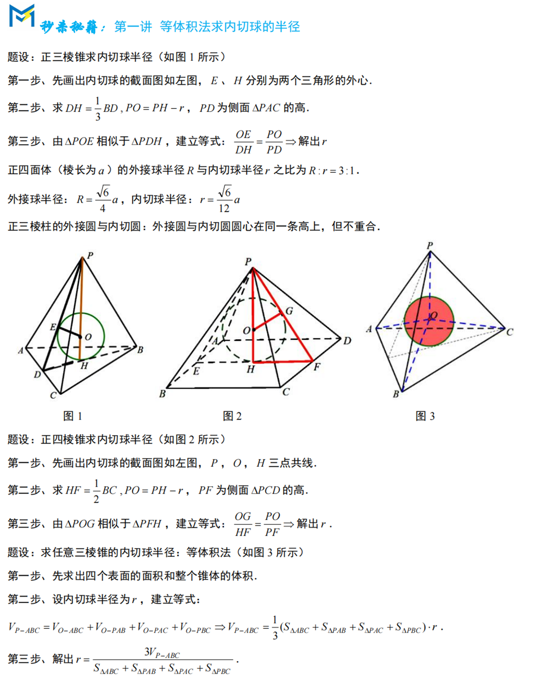
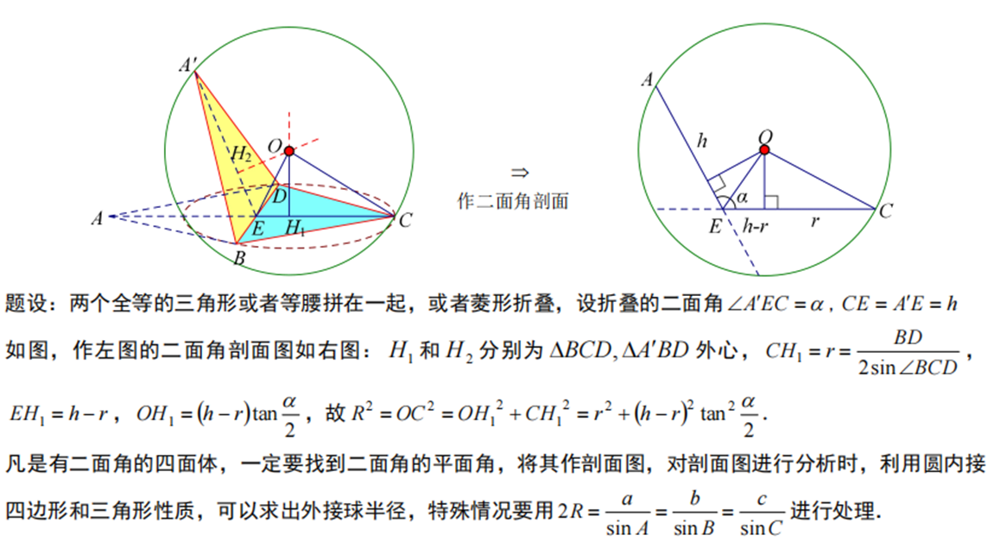
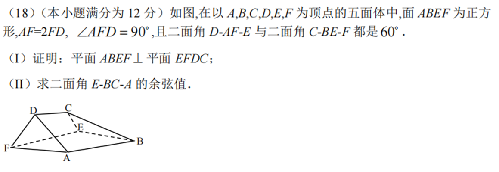
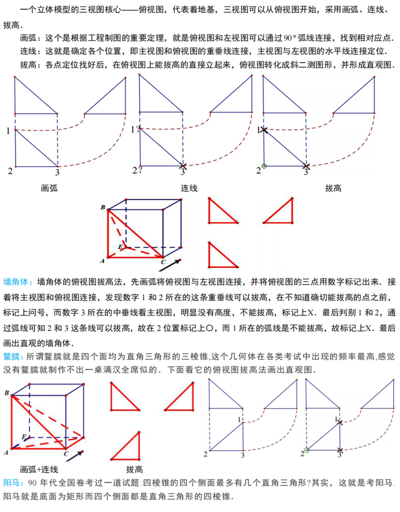

高考对于立体几何的考察在小题和解答题中均有涉及，同时其与空间向量结合相对紧密，难度可高可低，（高考整体难度偏低）

1立体几何的证明问题

总结两句句话：证明时要摆全，建系法亦可证明

2法向量的快速求法

此中运用到了矩阵的思想，熟练掌握后大有作用

3外接球内切球问题

①补形秒杀

4建系注意事项

立体几何中要先证垂直或已经确定才可建系，不可仅是看起来像就直接用

参考2016年立体几何

5三视图

