众所周知,解析几何是数学史上划时代的里程碑式的登峰造极之作.在解析几何中,方程是刻画曲线性质的代数语言,而曲线又是描绘方程特征的图象语言，数与形的高度统一，使得两者浑然一体，相得益彰.所以，解析几何是神奇的,它不仅把代数和几何融合在一起,而且把曲面与平面统一在一起,数形结合的思想在这里获得圆满的体现，在解析几何中时刻闪烁着数形结合的光芒。数学家拉格朗日说过:“只要代数和几何分道扬镳,它们各自的发展就变得缓慢,它们的应用就变得狭窄.代数与几何两门学科一旦联袂而往,它们就会从对方吸收新鲜的活力,从而大踏步地走向各自的完美.”解析几何把方程与曲线进行了深度捆绑.如果说方程是曲线的神圣化身,那曲线则是方程的完美舞姿.所以,有人说曲线与方程“你是风儿.我是沙，缠缠绵绵绕天涯".

1对称问题

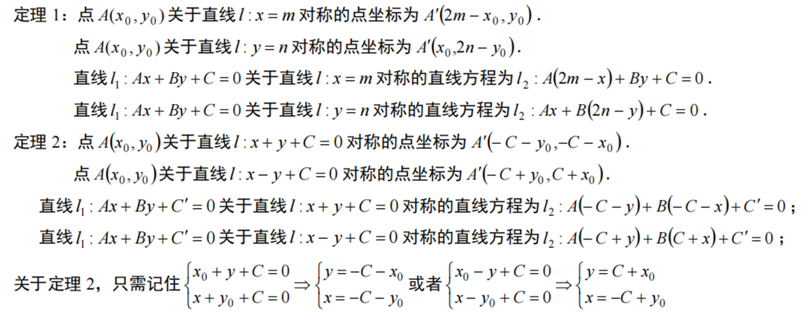

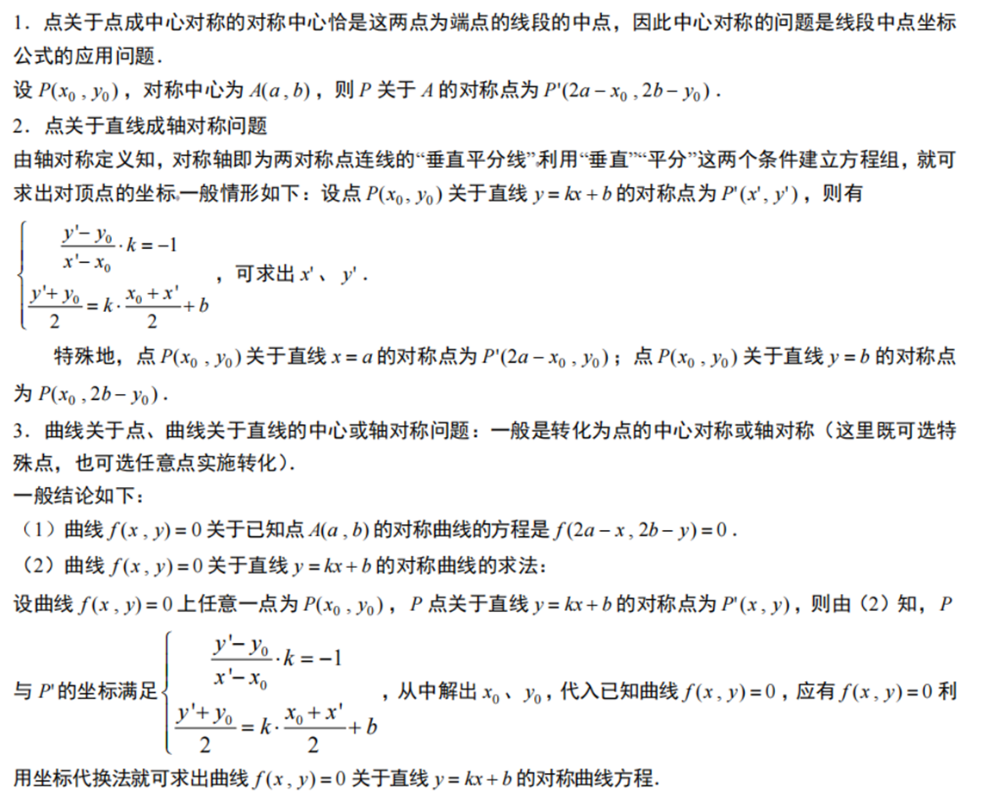

2直线系和圆系方程

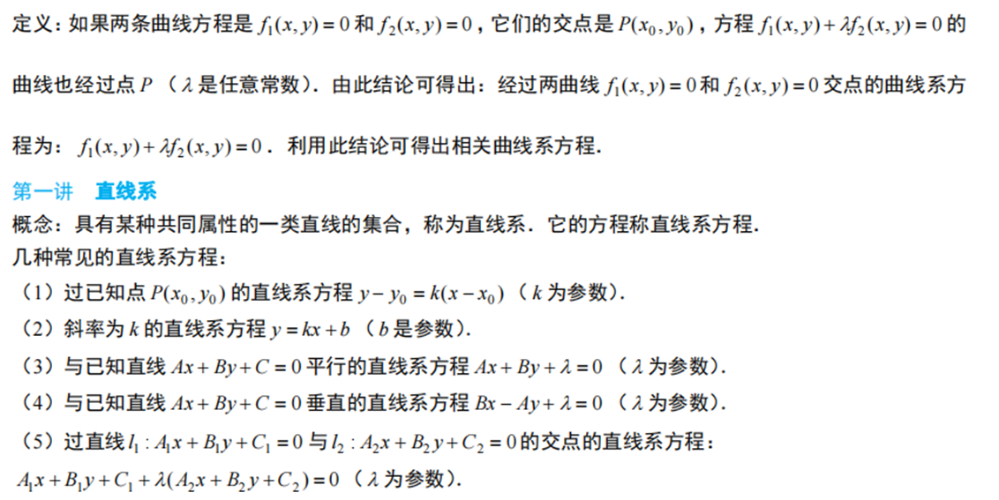

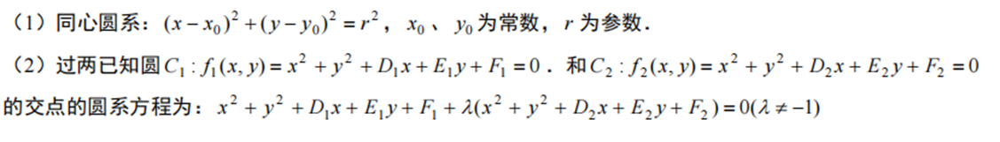

2圆锥曲线硬解定理

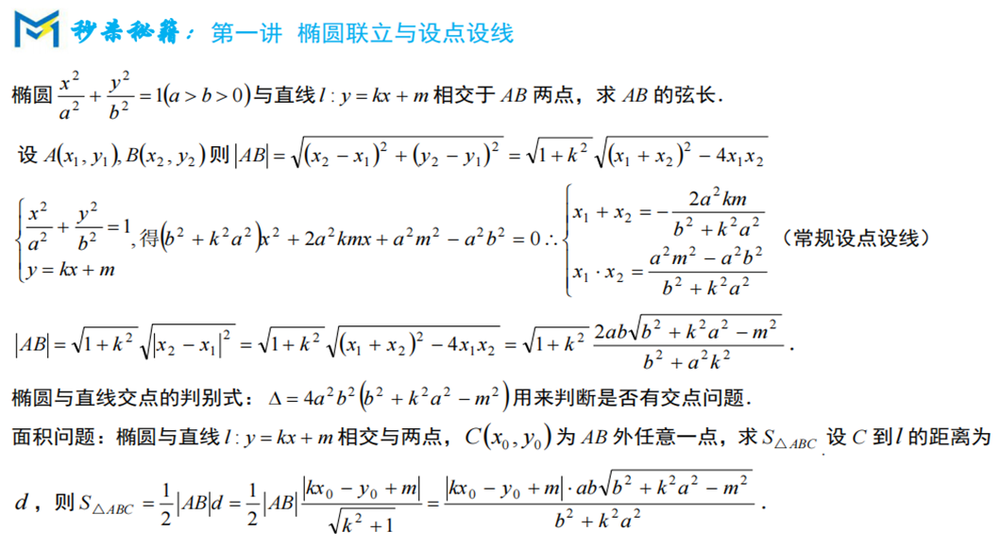

如有能力可以记忆，但是使用一定要确保自己背记准确

3椭圆双曲线结论（看法）

圆锥曲线的结论是高中数学最多，最繁杂的，盲目记忆仅是浪费时间与影响解题思路

 

推荐记忆常见思路，仅熟悉套路而不关注具体数据

4抛物线结论

相较与椭圆与双曲线，抛物线的结论更加实用

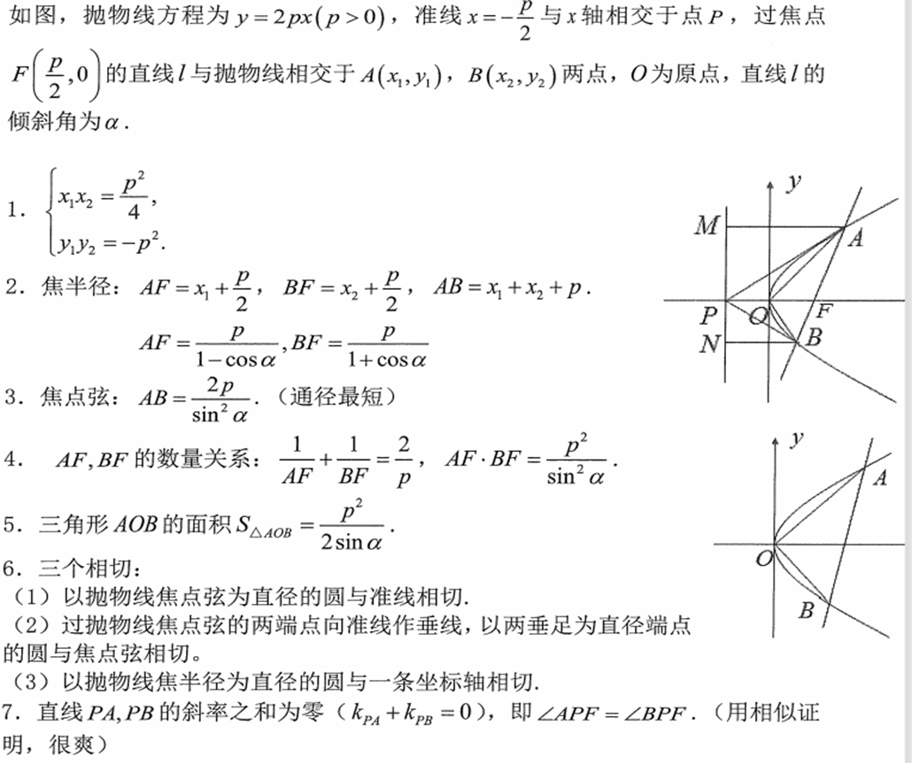

5抛物线中的阿基米德三角形

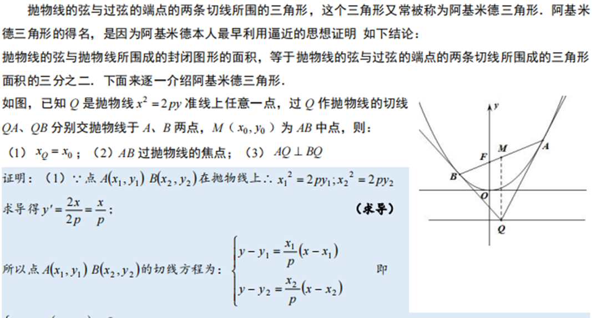

（此处仅仅提到定义为止。2021全国乙卷已考，所以笔者认为再次考察概率相对小）

6圆锥曲线的切线方程

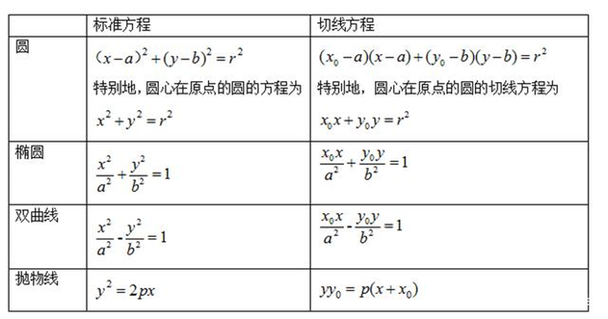

推导使用“隐函数法”或者“求导法”

7仿射变换

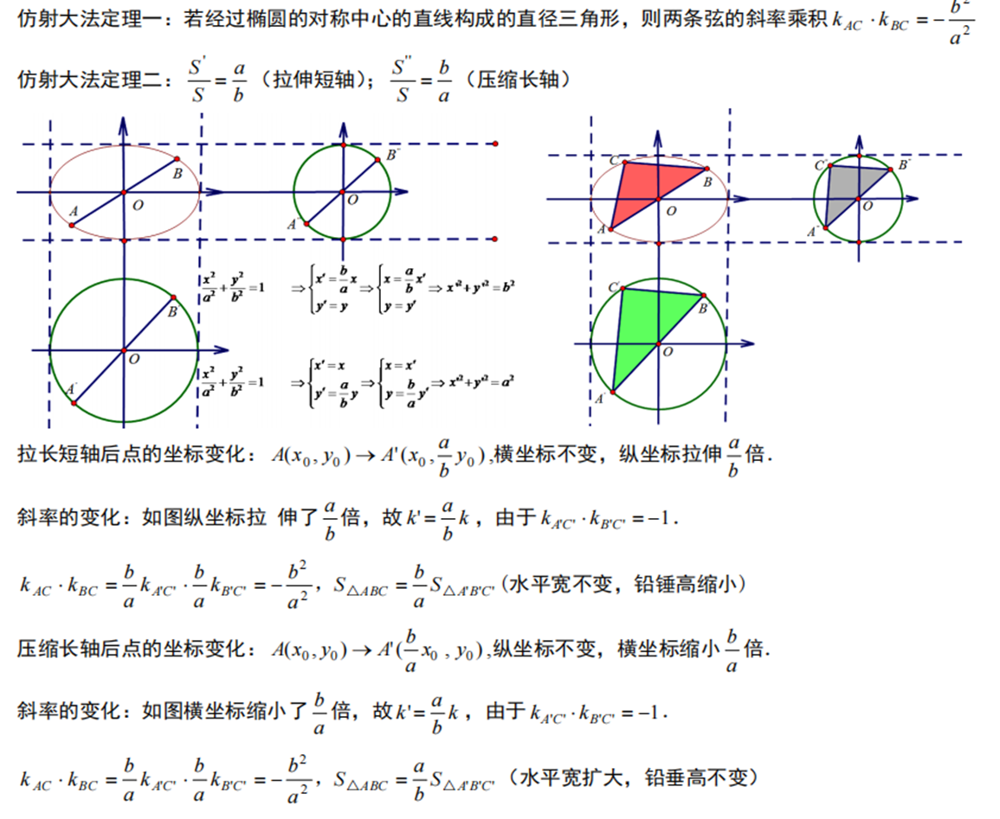

仿射变换在课本中出现，但是常用于一些结论的证明中，实际应用极少（如非特别熟练勿用）

8焦半径公式两种

第一种：与坐标有关

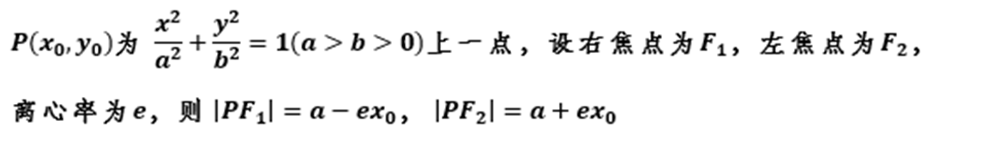

第二种：与倾斜角有关

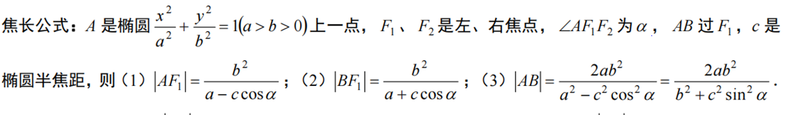

9斜率齐次化

此法主要应用于题给条件涉及到斜率

有两种写法（平移直线）（平移坐标系）一般写法均为平移直线

要证明直线AP与AQ的斜率之和或者斜率之积为定值，公共点A（x0，y0）设直线为m（x-x0）+n（y-y0）=1 (为什么这样设?因为这样齐次化更加方便)，与圆锥方程联立，一次项乘以m（x-x0）2+n（y-y0）2，常数项乘以{m（x-x0）+n（y-y0）}2构造a（x-x0）2+b（y-y0）2=0然后等式两边同时除以（x-x0）2 (前面注明（x-x0）2不等于0)，得到bk2 +a=0，可以直接利用韦达定理得出斜率之和或者斜率之积，即可得出答案

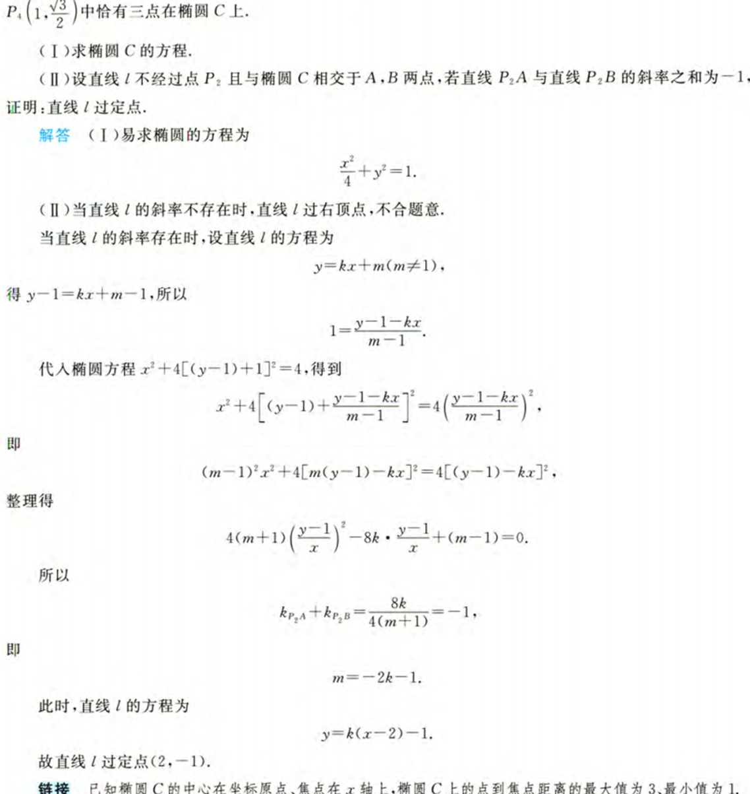

上为2017全国一卷题目

9圆锥曲线中参数方程的应用

10圆锥曲线中极坐标的应用

11圆锥曲线求离心率